# 智维售后 AgentOps 平台

智维售后 AgentOps 平台是一个面向企业售后技术支持知识库的 RAG + Agent 工程系统。项目采用 `React + Spring Boot + FastAPI + PostgreSQL/pgvector` 架构，把文档入库、混合检索、售后诊断 Agent、RAGAS 评测、人工审核、实验对比和可观测性串成完整闭环。

项目当前以 React 前端为主工作台，旧 Vue 前端已删除。浏览器只访问 Spring Boot `/api/*`，FastAPI AI 服务只作为内部 RAG / Agent / evaluator 服务使用。

## 个人知识库来源

本项目使用的个人知识库语料来自 [Obsidian AI 学习笔记库](https://github.com/HeWhenJay/obsidian-study-notes)。该笔记库整理了 AI Agent、RAG、LangChain、LangGraph、GraphRAG、多 Agent、MCP、A2A、Agent Skills、AutoGen、CrewAI 等学习笔记、图解和示例代码。

这个平台用于把上述笔记沉淀成本地可检索、可追溯、可评估的知识库：从 Obsidian Markdown 笔记入库，到 RAG/GraphRAG 检索、引用来源展示、问答生成、售后诊断和评测闭环。需要阅读原始笔记内容时，请访问笔记仓库；需要体验检索问答链路时，请运行本项目。

## 当前状态

- 前端：React 18 + TypeScript + Vite，覆盖售后问答、文档入库、知识库、实验评测、图谱、反馈和设置页面。
- Java 后端：Spring Boot 统一暴露 `/api/*`，负责业务 CRUD、数据库迁移、RAG run 持久化、评测集管理、批量评测编排和 AI 服务桥接。
- Python AI 服务：FastAPI 暴露内部 `/ai/*`，负责文档解析、chunk、embedding、检索、重排、生成、Advanced RAG preset、GraphRAG、Support Supervisor Agent、RAGAS 和 evaluator。
- 数据库：PostgreSQL + pgvector，统一承载业务数据、文档 chunk、embedding、RAG run、retrieval results、评测集、评测历史和图谱事实。
- 评测平台：已支持评测集管理、单样本评估、批量跑同一批样本对比不同 RAG preset，并结构化记录 `recall@k`、`precision@k`、`MRR`、`citation_hit`、token、成本和分阶段耗时。
- AgentOps 路线图：已完成 Support Supervisor 与 RAGAS 半自动测评闭环；下一阶段重点补齐 Agent Flight Recorder、Tool Registry、MCP、Agent Memory、AgentEval、风险审批与知识运营控制面。

## 系统总览

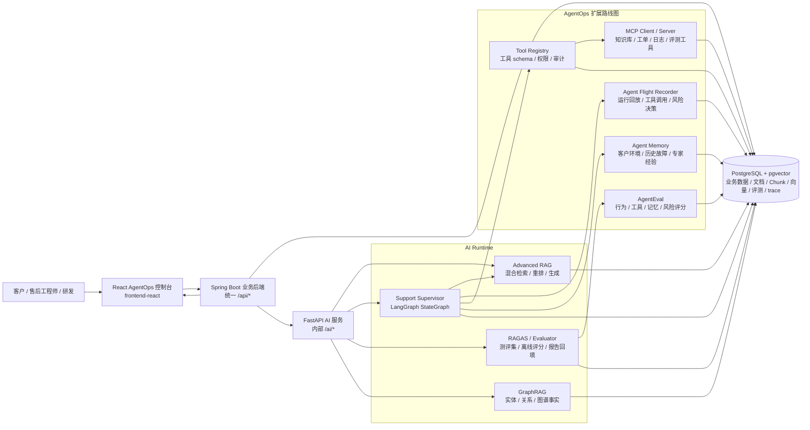

- 前端只调用 Spring Boot `/api/*`，不直接调用 FastAPI。
- Spring Boot 只做业务、桥接和持久化，不实现 RAG / evaluator 算法。
- FastAPI 负责 RAG、Agent、GraphRAG、文档解析、检索生成和指标计算。
- 数据库变更必须通过 `backend-java/src/main/resources/db/migration/` 下的 Flyway 迁移脚本。

## 详细业务流程图

### 售后问题从提交到解决

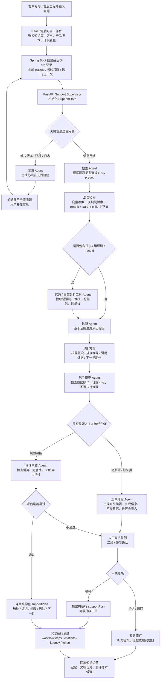

### Support Supervisor 运行时编排

售后 Agent 不是单个提示词直出答案，而是由 `Support Supervisor` 统一编排多个职责明确的节点。Supervisor 负责维护状态、决定下一步节点、记录 `workflowSteps`，并最终产出结构化 `supportPlan`。

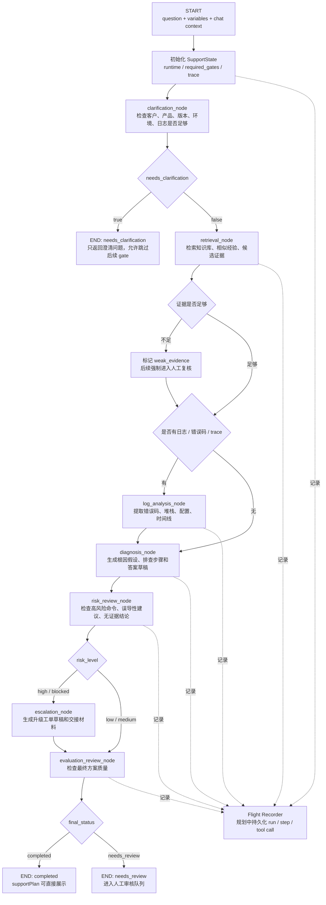

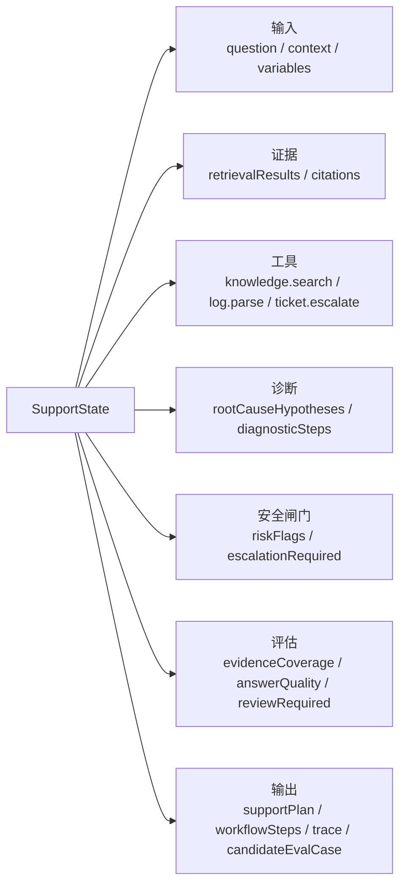

对应实现位置：

- `ai-service/app/agents/graphs/support_supervisor.py`：Supervisor 状态图入口与路由。
- `ai-service/app/agents/states/support_state.py`：跨节点共享状态。
- `ai-service/app/agents/nodes/`：澄清、检索、诊断、风险审查、工单升级、代码 / 日志分析、评估审查等节点。
- `ai-service/app/services/agent_service.py`：对外 Agent 调用入口，负责选择售后模式并返回 `supportPlan`。

### 文档入库与知识运营

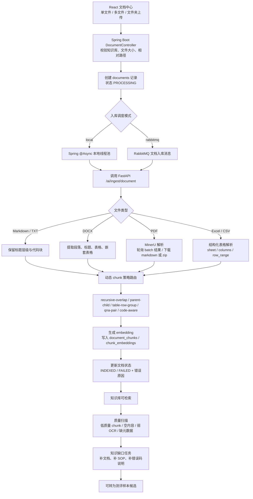

### 测评集生成、人工审核与前端评测

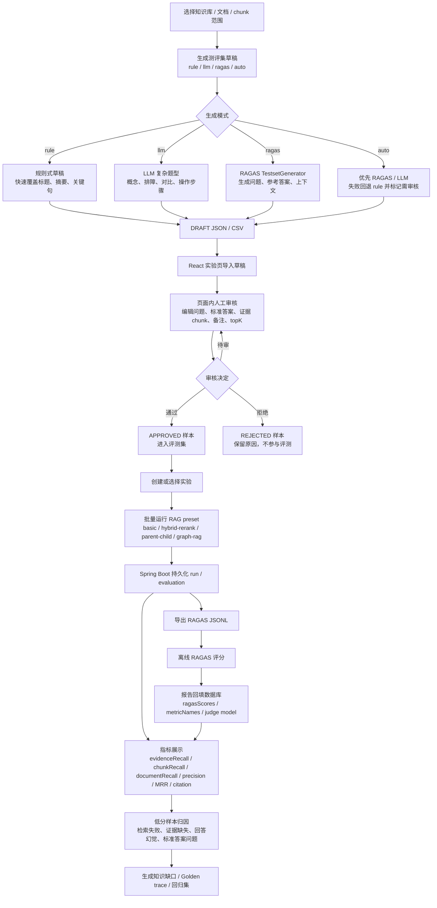

### 工具调用、MCP 与审计链路

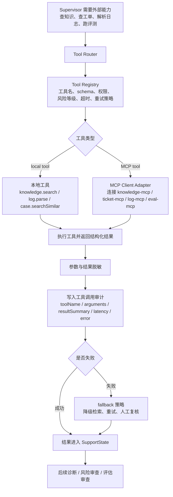

### Agent 记忆与专家经验沉淀

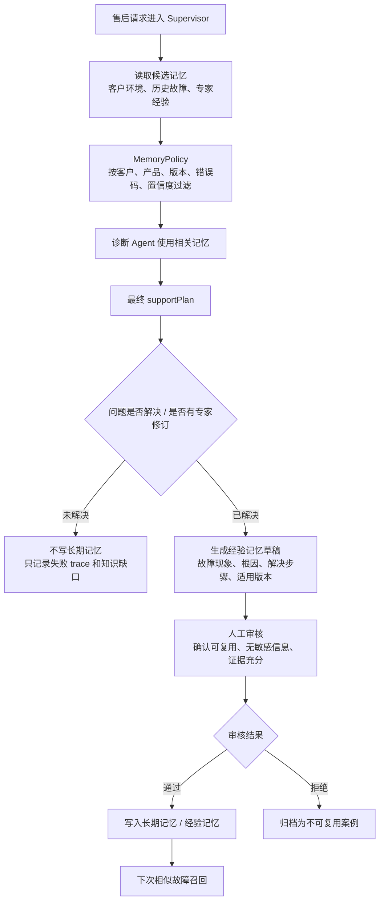

### AgentOps 前端操作路径

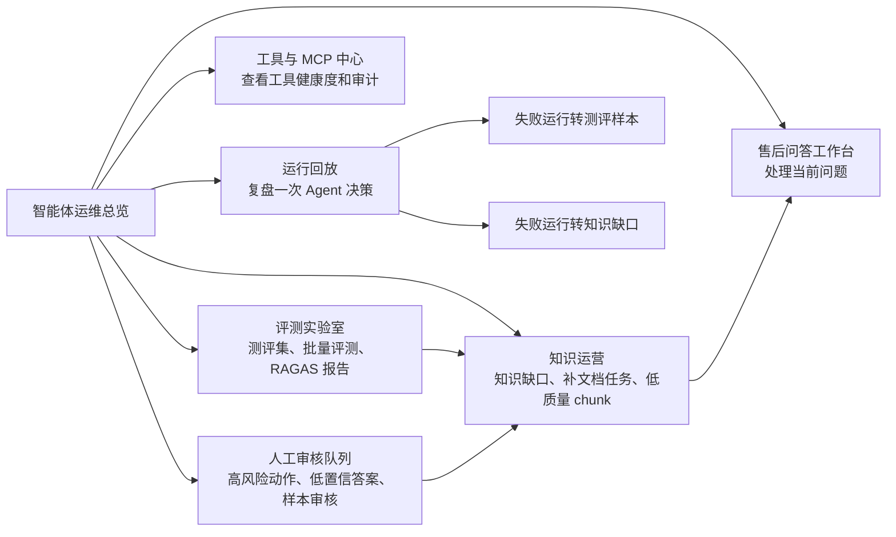

## 本地依赖

- Node.js 24 或兼容版本
- Java 21
- Maven 3.9+
- Python 3.12
- PostgreSQL + pgvector
- Docker / Docker Compose，可用于启动本地依赖

## 快速开始

1. 准备环境变量：

```powershell
Copy-Item .env.example .env
```

2. 启动基础依赖：

```powershell
.\scripts\dev-start.ps1
```

3. 启动 Java 后端：

```powershell
cd backend-java
mvn spring-boot:run
```

4. 启动 Python AI 服务：

```powershell
cd ai-service
python -m venv .venv
.\.venv\Scripts\python.exe -m pip install -e ".[dev]"
.\.venv\Scripts\python.exe -m uvicorn app.main:app --reload --port 8001
```

如果本机虚拟环境是 `bin` 目录，可改用：

```powershell
.\.venv\bin\python.exe -m uvicorn app.main:app --reload --port 8001
```

5. 启动 React 前端：

```powershell
npm.cmd --prefix frontend-react install
npm.cmd --prefix frontend-react run dev
```

## 常用验证

```powershell
npm.cmd --prefix frontend-react run typecheck
npm.cmd --prefix frontend-react run build
mvn.cmd -f backend-java\pom.xml test
.\ai-service\.venv\bin\pytest.exe ai-service\tests
```

## 模块说明

- `frontend-react/`：React 前端主工作台，负责知识库、文档入库、售后问答、实验评测、图谱、反馈和设置交互。
- `backend-java/`：Spring Boot 业务后端，负责 `/api/*`、Flyway 迁移、业务持久化、RAG run 记录和 AI 服务桥接。
- `ai-service/`：FastAPI AI 服务，负责 `/ai/*`、文档解析、Advanced RAG、GraphRAG、Support Supervisor Agent、RAGAS、evaluator 和 trace。
- `infra/`：本地基础设施配置，当前重点是 PostgreSQL + pgvector。
- `scripts/`：本地依赖启动、停止、数据库重置和全链路 smoke 辅助脚本。
- `docs/`：计划、交接、review prompt、失败复盘和架构说明。

## 模块流程图

### React 前端工作台

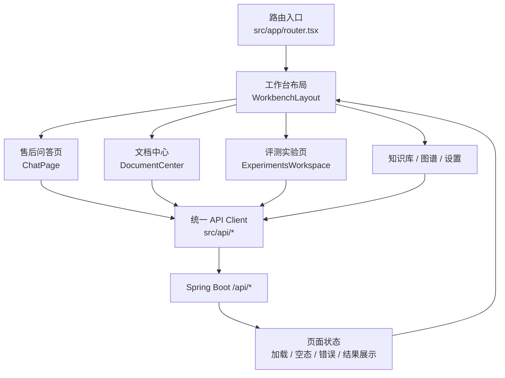

### Spring Boot 业务后端

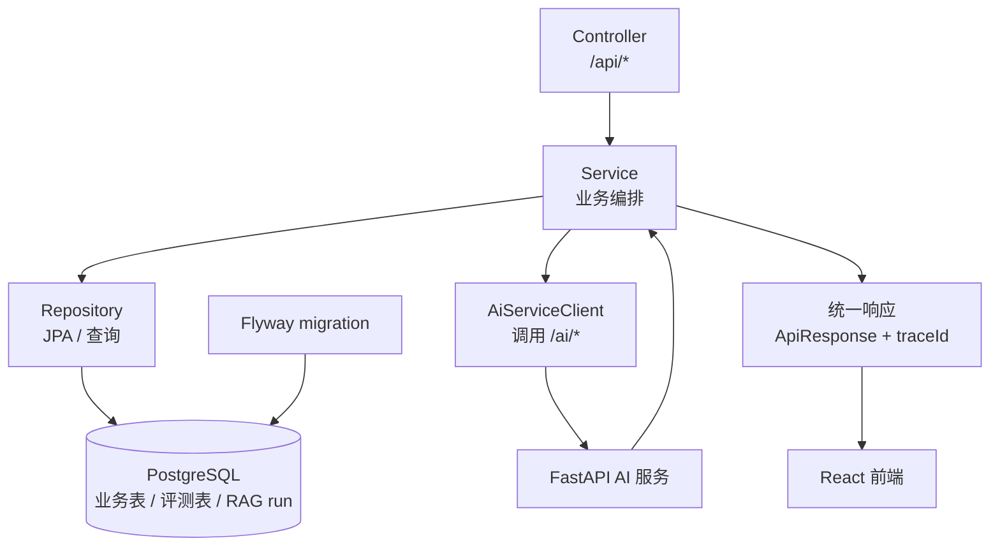

### FastAPI AI 服务

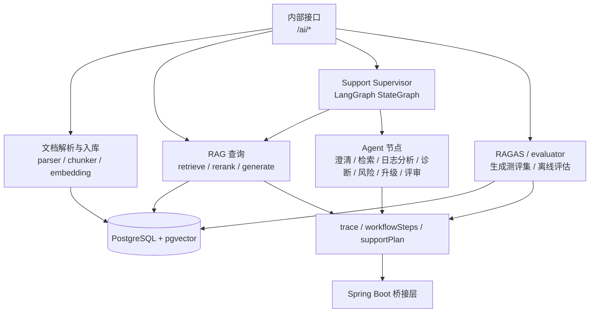

### 数据与基础设施

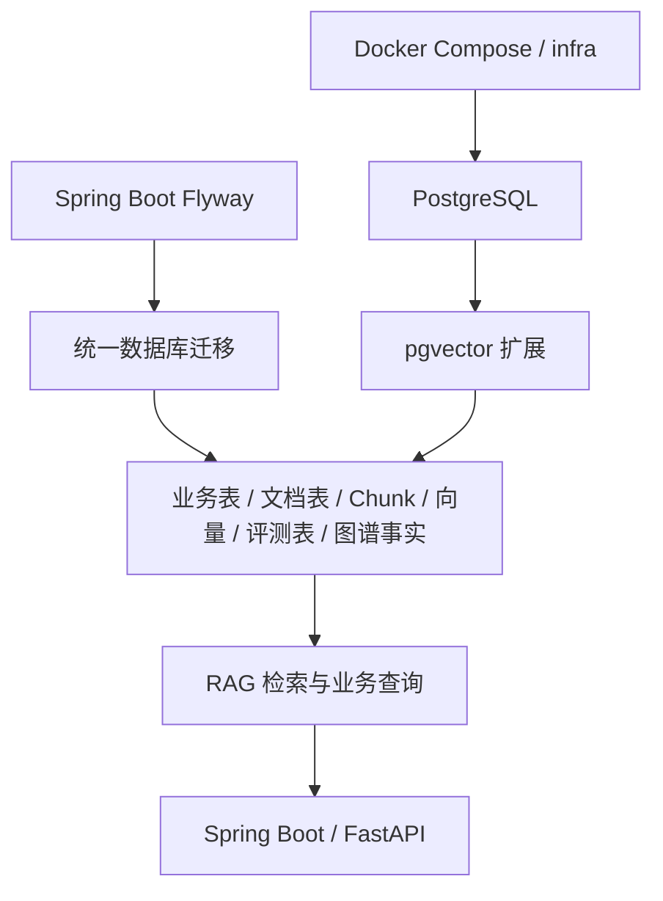

### 脚本与文档

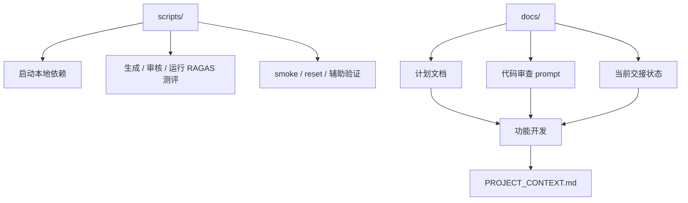

## 当前重点文档

- 项目上下文：[PROJECT_CONTEXT.md](PROJECT_CONTEXT.md)
- 当前交接：[docs/handoff/CURRENT_STATE.md](docs/handoff/CURRENT_STATE.md)
- API 设计：[docs/architecture/api-design.md](docs/architecture/api-design.md)
- 数据库设计：[docs/architecture/database-design.md](docs/architecture/database-design.md)
- 售后 Agent 架构：[docs/plans/2026-06-18-support-supervisor-multi-agent-workflow.md](docs/plans/2026-06-18-support-supervisor-multi-agent-workflow.md)
- RAGAS 测评闭环：[docs/plans/2026-06-18-ragas-testset-generation-report-review-flow.md](docs/plans/2026-06-18-ragas-testset-generation-report-review-flow.md)
- AgentOps 生产级升级路线图：[docs/plans/2026-06-18-agentops-production-upgrade-roadmap.md](docs/plans/2026-06-18-agentops-production-upgrade-roadmap.md)

## 开发约定

- 每次开发前先看 `PROJECT_CONTEXT.md` 和 `docs/handoff/CURRENT_STATE.md`。
- Prompt 统一放在 `ai-service/app/prompts/`。
- 前端 API 调用统一放在 `frontend-react/src/api/`。
- Java DTO / Entity / migration / 前端类型 / Python schema 需要保持字段契约一致。
- 不提交真实 API key、数据库密码、模型 token 或完整认证头。
