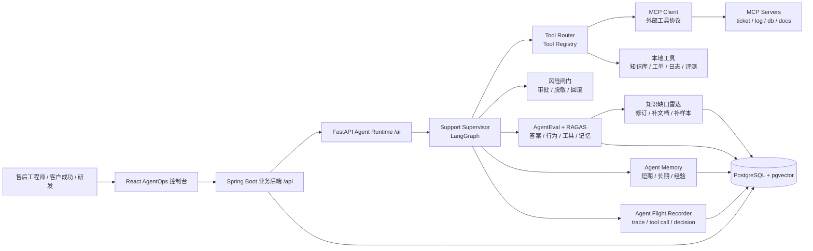
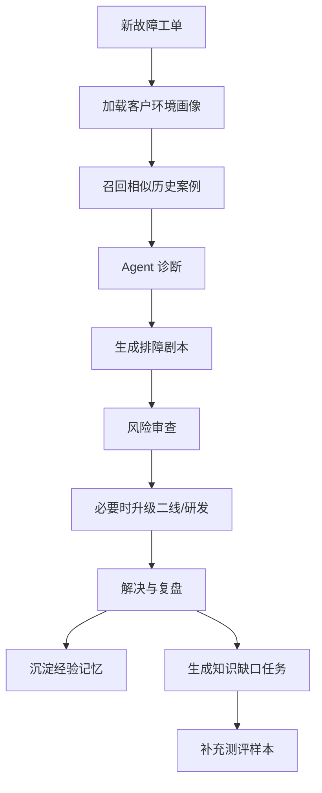
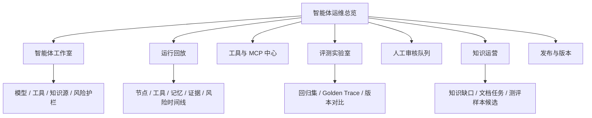

# 2026-06-18 AgentOps 生产级升级路线图

## 1. 背景判断

当前项目已经超过普通 RAG demo：具备 React 工作台、Spring Boot 业务后端、FastAPI AI 服务、pgvector、Advanced RAG、Support Supervisor、RAGAS 测评集与人工审核流。

但如果目标是写进简历并体现生产级 Agent 差异化，当前仍有明显短板：

- Agent 缺少持久化记忆，无法沉淀客户环境、历史故障和专家修订。
- 工具调用还停留在内部函数编排，没有 Tool Registry、权限、参数审计和调用回放。
- MCP 没有接入，无法体现现代 Agent 工具协议化能力。
- 评估体系偏 RAG，缺少 Agent 行为评估、工具选择评估、记忆使用评估和 golden trace。
- 前端更像功能工作台，缺少 AgentOps 控制面、运行回放、风险审批和知识运营视角。
- 售后领域业务对象不足，缺少客户、产品版本、部署环境、工单、SLA、相似案例和排障剧本。

因此下一阶段不应继续堆更多 RAG preset，而应把项目从：

```text
RAG + 售后问答工作台
```

升级为：

```text
企业售后技术支持 AgentOps 平台
```

## 2. 目标定位

### 2.1 新定位

构建一个面向企业售后技术支持场景的 AgentOps 平台，支持：

- 售后故障问答与排障诊断。
- 客户环境画像和长期记忆。
- 相似历史故障召回。
- 工具调用、MCP 接入和调用审计。
- Agent Flight Recorder 运行回放。
- 风险闸门、人工审批和工单升级。
- RAGAS + AgentEval 双评测闭环。
- 知识缺口发现和专家修订沉淀。

### 2.2 简历目标表达

最终项目可以包装为：

> 设计并实现企业售后技术支持 AgentOps 平台，基于 LangGraph Supervisor 编排澄清、检索、日志分析、诊断、风险审查、工单升级与评估审查节点；引入持久化 Agent Memory、MCP 工具调用层、Tool Registry、Agent Flight Recorder、风险审批、客户环境画像、相似故障召回与 Agent 行为评估体系，实现从 RAG 问答到可治理、可评估、可复盘的生产级 Agent 系统升级。

## 3. 北极星指标

项目升级后的核心指标不是“能不能回答”，而是“能不能稳定处理售后问题并持续变好”。

| 指标 | 含义 | 目标 |
| --- | --- | --- |
| 首次有效诊断率 | 第一轮给出可执行排障方向的比例 | >= 70% |
| 必要澄清覆盖率 | 缺少版本/环境/日志时是否先澄清 | >= 85% |
| 工具选择准确率 | Agent 是否选择了正确工具 | >= 80% |
| 工具参数准确率 | 工具调用参数是否完整、合法 | >= 85% |
| 证据引用命中率 | 答案是否引用正确 chunk / case | >= 80% |
| 风险操作拦截率 | 高风险操作是否触发审批/提示 | >= 95% |
| 升级判断准确率 | 是否正确判断二线/研发升级条件 | >= 80% |
| 记忆使用有效率 | 客户画像/历史故障是否被正确使用 | >= 70% |
| 知识缺口发现率 | 低分样本能否生成知识维护任务 | >= 80% |

## 4. 目标架构



## 5. 核心能力拆解

### 5.1 Agent Flight Recorder

目标：让每次 Agent 运行都可回放、可审计、可评分。

需要记录：

- 用户输入和上下文。
- Supervisor 状态迁移。
- 每个节点输入/输出。
- 工具选择原因。
- 工具调用参数。
- 工具结果摘要。
- 记忆读取/写入记录。
- 风险闸门判断。
- 人工接管点。
- 最终 `supportPlan`。

后端数据表建议：

```text
agent_runs
agent_run_steps
agent_tool_calls
agent_memory_events
agent_risk_decisions
agent_handoff_events
```

前端页面：

- Agent 运行列表
- 单次运行回放
- 工具调用时间线
- 节点状态图
- 风险/审批记录
- 输入输出 diff

### 5.2 Agent Memory 记忆系统

目标：让 Agent 能沉淀客户、环境、案例和专家经验。

三层记忆：

| 类型 | 内容 | 生命周期 | 例子 |
| --- | --- | --- | --- |
| 短期记忆 | 当前会话、澄清答案、临时日志 | 会话级 | 当前客户使用 v2.3.1，报错 E1024 |
| 长期记忆 | 客户环境、部署方式、历史偏好 | 客户级 | 私有化部署，PostgreSQL 14，禁用外网 |
| 经验记忆 | 成功排障、失败案例、专家修订 | 全局复用 | 某错误码在 2.3.1 常由连接池配置导致 |

后端数据表建议：

```text
support_customers
support_products
support_product_versions
support_environments
agent_memories
agent_memory_links
support_case_memories
expert_revision_memories
```

AI 服务能力：

- `MemoryRetriever`：按客户、产品、版本、错误码召回记忆。
- `MemoryWriter`：从已解决工单和专家修订中写入经验记忆。
- `MemoryPolicy`：控制哪些内容可写入长期记忆。
- `MemoryEvaluator`：评估记忆是否被正确使用。

### 5.3 Tool Registry 与工具调用

目标：让工具调用从内部函数升级为可注册、可授权、可审计的系统能力。

首批工具：

| 工具 | 作用 | 风险等级 |
| --- | --- | --- |
| `knowledge.search` | 检索知识库 chunk | 低 |
| `case.searchSimilar` | 检索相似历史工单 | 低 |
| `customer.getProfile` | 查询客户环境画像 | 中 |
| `log.parse` | 解析日志、错误码、堆栈 | 低 |
| `ticket.createEscalation` | 生成升级工单 | 中 |
| `sop.generate` | 生成排障剧本 | 低 |
| `eval.runAgentCase` | 运行 Agent 评估 | 中 |
| `report.exportMarkdown` | 导出诊断报告 | 低 |
| `sql.readonlyQuery` | 只读查询诊断信息 | 高 |

数据表建议：

```text
agent_tools
agent_tool_permissions
agent_tool_call_logs
agent_tool_schemas
```

实现要求：

- 每个工具有 JSON Schema。
- 每次调用保存参数、结果、耗时、错误。
- 高风险工具需要风险闸门。
- 工具结果必须参与 Agent trace。

### 5.4 MCP 接入层

目标：体现现代生产 Agent 的工具协议化能力。

建议先做本地 MCP Server，不急着接复杂外部系统。

MCP Server 规划：

| MCP Server | 暴露能力 |
| --- | --- |
| `knowledge-mcp` | 搜索知识库、读取 chunk、查询文档 |
| `ticket-mcp` | 查询工单、创建升级工单、写复盘 |
| `log-mcp` | 解析日志、提取错误码、聚合时间线 |
| `customer-mcp` | 查询客户画像、产品版本、部署环境 |
| `eval-mcp` | 运行 RAGAS / AgentEval、读取评测报告 |

AI 服务改造：

- 新增 `app/agents/mcp/`
- 实现 MCP client adapter。
- Tool Registry 同时支持 local tool 和 MCP tool。
- Supervisor 不直接依赖具体工具实现，只依赖统一 tool interface。

### 5.5 售后领域业务对象

目标：让系统从问答项目变成真实售后业务系统。

新增核心对象：

```text
客户 Customer
产品 Product
产品版本 ProductVersion
部署环境 Environment
工单 Ticket
故障 Incident
故障等级 Severity
SLA Policy
相似案例 SimilarCase
排障剧本 TroubleshootingPlaybook
专家修订 ExpertRevision
知识缺口 KnowledgeGap
```

首批数据库表：

```text
support_customers
support_products
support_product_versions
support_environments
support_tickets
support_ticket_events
support_incidents
support_playbooks
support_expert_revisions
support_knowledge_gaps
```

业务闭环：



### 5.6 AgentEval 评估体系

目标：从“评答案”升级为“评 Agent 行为”。

评估对象：

- 最终回答质量。
- 工具选择。
- 工具参数。
- 记忆召回。
- 澄清问题。
- 风险识别。
- 升级判断。
- SOP 可执行性。
- trace 是否符合 golden path。

数据模型：

```text
agent_eval_cases
agent_eval_expected_tool_calls
agent_eval_expected_memories
agent_eval_expected_risks
agent_eval_runs
agent_eval_scores
agent_eval_findings
```

核心指标：

| 指标 | 含义 |
| --- | --- |
| `tool_selection_score` | 是否选择正确工具 |
| `tool_argument_score` | 工具参数是否正确 |
| `memory_recall_score` | 是否使用正确记忆 |
| `clarification_score` | 是否提出必要澄清 |
| `risk_gate_score` | 是否识别风险操作 |
| `escalation_score` | 是否正确升级 |
| `playbook_executability_score` | SOP 是否可执行 |
| `trace_match_score` | 是否匹配 golden trace |
| `final_answer_score` | 最终答案质量 |

前端页面：

- Agent 评测集管理
- Golden trace 编辑器
- AgentEval 批量运行
- Agent 版本对比
- 失败样本归因

### 5.7 知识缺口雷达

目标：把低质量回答转化为知识库运营任务。

触发来源：

- RAGAS 低分。
- AgentEval 低分。
- 专家拒绝答案。
- 用户负反馈。
- 工具调用失败。
- 找不到相似案例。

输出任务：

- 缺少错误码文档。
- 某产品版本缺少排障 SOP。
- 某 chunk 证据质量低。
- 某答案需要专家修订。
- 某问题应加入测评集。

数据表：

```text
support_knowledge_gaps
support_knowledge_gap_evidence
support_knowledge_tasks
```

## 6. 前端升级计划

### 6.0 生产级 Agent 前端经验复盘

这次联网调研的结论是：生产级 Agent 前端不是一个更漂亮的聊天框，而是“构建、运行、观测、治理、评测、人工接管”一体化控制面。可以参考的产品方向包括：

- [Salesforce Agentforce Observability](https://www.salesforce.com/agentforce/observability/) / Agentforce Command Center：强调统一任务控制台、近实时性能监控、交互下钻、成本与效果优化。
- [ServiceNow AI Control Tower](https://www.servicenow.com/products/ai-control-tower.html) / AI Agent Studio：强调发现企业内所有 Agent、模型与身份，统一做风险治理、合规、运行时性能监控和价值度量；构建器内提供护栏、真实数据测试和上线前验证。
- [Microsoft Copilot Studio](https://learn.microsoft.com/en-us/microsoft-copilot-studio/analytics-overview)：强调从构建、测试、发布到分析的闭环，分析页支持关键指标总览和组件级下钻，区分会话型 Agent 与自主型 Agent。
- [LangSmith Observability](https://www.langchain.com/langsmith/observability) / [LangSmith Evaluation](https://docs.langchain.com/langsmith/evaluation)：强调端到端 trace、成本与延迟、失败定位、从人工样本 / 生产 trace / 合成数据构建评测集，并用人工审核、代码规则、LLM 裁判和成对比较做实验评估。
- [Intercom Fin 报表](https://www.intercom.com/help/en/articles/7837533-fin-ai-agent-reporting) / [Fin Performance Dashboard](https://www.intercom.com/help/en/articles/11390083-monitor-fin-s-performance-with-clarity-and-confidence)：强调客服场景的自动化率、解决率、转人工、客户体验分和问题提前发现。
- [Zendesk AI agents dashboard](https://support.zendesk.com/hc/en-us/articles/9748041653658-Using-the-dashboard-to-monitor-and-manage-AI-agents-AI-agents-Advanced-only)：强调 Agent 工作区总览、整体指标、Agent 管理和运维入口。
- [CrewAI Control Plane](https://crewai.com/)：强调控制面进入每次工作流执行路径，让 LLM 调用、工具调用、记忆读取、成本和合规状态都可观测、可逆转。

共性模式如下：

| 生产级前端模式 | 产品里的表现 | 本项目要复现的能力 |
| --- | --- | --- |
| 控制塔 | Agent fleet 总览、健康度、成本、延迟、失败率、业务价值 | `智能体运维总览`：展示售后自动解决率、转人工率、风险待审数、平均耗时、成本、失败类型 |
| Agent 构建器 | 角色、指令、模型、工具、知识源、护栏、上线前测试 | `智能体工作室`：配置 Supervisor 版本、节点开关、工具权限、知识库范围、风险规则 |
| 运行回放 | 对话、节点、工具调用、记忆读取、证据、错误栈时间线 | `运行回放`：复盘一次售后请求为什么这么判断、为什么升级、用了哪些证据 |
| 工具中心 | 工具 schema、权限、风险等级、调用日志、成功率、耗时 | `工具与 MCP 中心`：管理 `knowledge.search`、`log.parse`、`ticket.createEscalation` 等工具 |
| 评测实验室 | 数据集、模拟会话、回归实验、版本对比、人工裁判 | `评测实验室`：合并 RAGAS、AgentEval、Golden trace 和版本回归 |
| 人工审核队列 | 高风险动作审批、转人工、专家修订、反馈回流 | `人工审核队列`：处理高风险建议、缺证据回答、测评样本审核、专家修订 |
| 知识运营 | 未回答问题、过期内容、知识缺口、低质量证据 | `知识运营`：把失败 trace 转成文档补充任务、相似案例任务、测评样本候选 |
| 发布治理 | 版本、环境、灰度、回滚、变更记录、审计 | `发布与版本`：管理 Supervisor 配置版本、提示词版本、工具版本和评测门禁 |

推荐的信息架构：



落地时不要做营销式大首屏，也不要把每个能力做成孤立卡片。界面应该像运维控制台：左侧稳定导航，中间高密度表格 / 时间线 / 拓扑，右侧抽屉展示一次运行的证据、参数、风险和操作。所有用户可见文案优先中文，英文只保留必要技术名词，例如 MCP、trace、RAGAS、AgentEval。

### 6.1 新增导航结构

建议从当前工作台升级为 AgentOps 控制台：

```text
智能体运维总览
售后问答工作台
智能体工作室
运行回放
工具与 MCP 中心
记忆中心
评测实验室
人工审核队列
知识运营
工单中心
客户环境
文档中心
发布与版本
系统设置
```

### 6.2 关键页面

#### 智能体运维总览

- 顶部展示自动解决率、转人工率、高风险待审、平均耗时、平均成本、失败率。
- 中间展示 Agent 运行趋势、失败类型分布、工具调用健康度、知识缺口排行。
- 右侧展示待处理队列：高风险审批、专家修订、失败运行、待补知识、待回归评测。
- 支持按客户、产品版本、知识库、Supervisor 版本和时间范围筛选。

#### 智能体工作室

- 配置 Supervisor 版本、节点顺序、模型、提示词、知识源和工具权限。
- 每个节点展示输入、输出、失败策略、风险规则和必过闸门。
- 提供沙盒测试区：输入售后问题后立即看到节点路径、工具调用和风险判断。
- 发布前必须绑定评测集并通过门禁，避免未评测配置直接进入主流程。

#### Agent 运行回放页

- 左侧：运行列表、状态、耗时、成本。
- 中间：LangGraph 节点时间线。
- 右侧：工具调用、记忆读取、风险判断、最终输出。
- 支持按 traceId、客户、工单、失败类型筛选。
- 支持把失败运行一键转为评测样本、知识缺口或专家审核任务。

#### 工具与 MCP 中心

- 工具注册列表。
- 工具 schema。
- 最近调用日志。
- 失败率、平均耗时。
- 高风险工具审批记录。
- MCP server 连接状态、能力列表、权限范围和调用审计。

#### 记忆中心

- 客户环境画像。
- 历史故障记忆。
- 专家经验记忆。
- 记忆来源、置信度、更新时间。
- 记忆启用/停用。

#### 评测实验室

- AgentEval case 列表。
- Golden tool trace。
- 批量评测运行。
- 按 Agent 版本对比。
- 失败原因聚类。
- RAGAS 指标、工具选择准确率、记忆使用正确率、风险识别率、升级建议质量统一展示。

#### 人工审核队列

- 高风险工具动作审批。
- 缺证据或低置信回答复核。
- 自动生成测评样本审核。
- 专家修订答案回流到记忆、知识缺口和评测集。

#### 知识运营页

- 缺口列表。
- 来源证据。
- 影响问题数。
- 建议补充文档。
- 一键生成测评样本草稿。

## 7. 后端升级计划

### 7.1 Spring Boot 负责内容

- 售后业务对象 CRUD。
- Agent run / tool call / memory event 持久化。
- AgentEval case / run / score 持久化。
- 知识缺口任务管理。
- 前端 `/api/*` 聚合接口。
- AI 服务调用与结果入库。

### 7.2 新增 Controller

```text
SupportCustomerController
SupportTicketController
AgentRunController
AgentToolController
AgentMemoryController
AgentEvalController
KnowledgeGapController
```

### 7.3 新增服务

```text
SupportTicketService
AgentRunService
AgentToolAuditService
AgentMemoryService
AgentEvalService
KnowledgeGapService
```

## 8. AI 服务升级计划

### 8.1 目录结构

```text
ai-service/app/agents/
├── graphs/
├── nodes/
├── states/
├── tools/
├── memory/
├── mcp/
├── evals/
├── recorder/
└── policies/
```

### 8.2 核心组件

| 组件 | 作用 |
| --- | --- |
| `SupportSupervisorGraph` | 主状态图 |
| `ToolRegistry` | 工具注册与调用 |
| `McpToolAdapter` | MCP 工具适配 |
| `AgentMemoryStore` | 记忆读写 |
| `RiskPolicyEngine` | 风险规则 |
| `FlightRecorder` | trace 记录 |
| `AgentEvaluator` | 行为评估 |
| `KnowledgeGapDetector` | 知识缺口发现 |

## 9. 分阶段实施路线

### Phase 10：AgentOps 基座

目标：先把“运行可回放”做出来。

任务：

- 新增 `agent_runs`、`agent_run_steps`、`agent_tool_calls` 表。
- AI 服务新增 `FlightRecorder`。
- Support Supervisor 每个节点写入 step。
- 工具调用写入 tool call。
- 前端新增 Agent 运行回放页。

验收：

- 每次售后问答都能看到完整运行时间线。
- 能查看节点输入/输出摘要。
- 能查看工具调用参数和结果。

### Phase 11：工具调用系统

目标：让 Agent 工具调用从内部逻辑变成一等公民。

任务：

- 新增 Tool Registry。
- 定义工具 schema。
- 实现 `knowledge.search`、`log.parse`、`case.searchSimilar`、`ticket.createEscalation`。
- 接入风险等级。
- 前端新增工具调用页。

验收：

- Agent trace 中能看到工具选择原因。
- 工具调用可审计。
- 高风险工具能被阻断或要求审批。

### Phase 12：记忆系统

目标：让 Agent 具备客户和经验记忆。

任务：

- 新增客户、产品、版本、环境表。
- 新增 `agent_memories`。
- 实现 MemoryRetriever / MemoryWriter。
- Supervisor 诊断前读取客户环境和历史故障。
- 已解决工单可沉淀为经验记忆。
- 前端新增记忆中心。

验收：

- 输入客户 ID 后，Agent 能引用客户环境。
- 相似历史故障能影响诊断。
- 专家修订能转化为记忆。

### Phase 13：MCP 接入

目标：让项目具备协议化工具能力。

任务：

- 新增本地 `knowledge-mcp` server。
- 新增 `ticket-mcp` server。
- AI 服务实现 MCP client adapter。
- Tool Registry 支持 MCP tool。
- trace 中区分 local tool / MCP tool。

验收：

- Agent 能通过 MCP 调知识库工具。
- MCP 工具调用被完整审计。
- MCP 工具失败时有 fallback。

### Phase 14：AgentEval

目标：建立完整 Agent 评估体系。

任务：

- 新增 AgentEval 数据表。
- 定义 golden trace schema。
- 支持工具选择、工具参数、记忆、风险、升级、SOP 可执行性评分。
- 新增评测脚本。
- 前端新增 Agent 评测页。

验收：

- 能批量运行 AgentEval。
- 能看到每个 case 的行为评分。
- 能比较不同 Agent 版本。

### Phase 15：售后业务闭环

目标：从问答升级为售后处理系统。

任务：

- 工单中心。
- 故障时间线。
- SLA / 严重等级。
- 相似案例召回。
- 排障剧本生成。
- 升级工单摘要。
- 复盘沉淀。

验收：

- 一个故障从创建、诊断、升级、解决、复盘可以完整走通。
- Agent 能生成 SOP 和升级材料。

### Phase 16：知识缺口雷达

目标：把评估和用户反馈转成知识运营任务。

任务：

- KnowledgeGapDetector。
- 低分样本归因。
- 专家拒绝答案转任务。
- 缺口任务管理页。
- 一键生成补充测评样本。

验收：

- 低分评测能生成缺口任务。
- 缺口任务能关联文档、chunk、问题和建议。

## 10. 里程碑建议

### 一周内优先做

1. Agent Flight Recorder。
2. Tool Registry 初版。
3. Agent 运行回放前端。
4. 重构 Support Supervisor 工具调用 trace。

这四项完成后，项目立刻从“看起来像聊天系统”变成“可观测 Agent 系统”。

### 两周内优先做

1. 客户环境画像。
2. 相似故障案例召回。
3. 记忆中心。
4. AgentEval 最小闭环。

### 三到四周内完成

1. MCP 本地 server。
2. 风险审批。
3. 工单中心。
4. 知识缺口雷达。
5. 简历版 README 与演示脚本。

## 11. 技术风险

| 风险 | 影响 | 缓解 |
| --- | --- | --- |
| 功能过多导致范围失控 | 开发周期拉长 | 先做 Flight Recorder + Tool Registry |
| MCP 实现复杂 | 影响主线 | 先做本地最小 MCP server |
| AgentEval 指标难定义 | 评估不可解释 | 先做 golden trace 匹配和工具调用准确率 |
| 记忆污染 | 错误经验影响回答 | 加记忆来源、置信度、人工审核 |
| 前端页面过多 | 使用体验分散 | AgentOps 首页聚合关键指标 |
| 数据表膨胀 | 后端复杂度上升 | 先按审计/运行/记忆/评估四类分层 |

## 12. 验证策略

### 后端

```powershell
mvn.cmd -f backend-java/pom.xml test
```

重点覆盖：

- Agent run 写入。
- Tool call 写入。
- Memory CRUD。
- AgentEval case / run。
- Knowledge gap 生成。

### AI 服务

```powershell
.\ai-service\.venv\bin\python.exe -m pytest ai-service\tests -q
```

重点覆盖：

- Tool Registry。
- MCP adapter。
- MemoryRetriever / MemoryWriter。
- FlightRecorder。
- AgentEvaluator。
- RiskPolicyEngine。

### 前端

```powershell
npm.cmd --prefix frontend-react run typecheck
npm.cmd --prefix frontend-react run build
```

重点覆盖：

- Agent 运行回放页。
- 工具调用页。
- 记忆中心。
- AgentEval 页。
- 知识缺口页。

### E2E

建议新增 Playwright smoke：

- 创建客户环境。
- 创建工单。
- 运行售后 Agent。
- 查看运行回放。
- 审批高风险工具。
- 运行 AgentEval。
- 生成知识缺口。

## 13. 最终交付物

- AgentOps 控制台。
- Agent Flight Recorder。
- Tool Registry + 工具调用审计。
- MCP 本地 server 与 client adapter。
- Agent Memory 系统。
- AgentEval 评估体系。
- 售后工单业务闭环。
- 知识缺口雷达。
- README / 架构图 / 演示脚本 / 简历描述。

## 14. 推荐下一个开发任务

下一步不要先做 MCP，也不要先做复杂记忆。最推荐先做：

```text
Phase 10：Agent Flight Recorder + Tool Registry 初版
```

原因：

- 它最能立刻摆脱 toy demo 感。
- 它是记忆、MCP、评估、风险治理的共同底座。
- 它最适合前端可视化展示，也最适合写进简历。

最小切片：

1. 新增 `agent_runs`、`agent_run_steps`、`agent_tool_calls` 表。
2. Support Supervisor 每个节点写 step。
3. 检索、日志分析、升级建议改成显式 tool call。
4. 前端新增 Agent 运行回放页面。
5. 用 3 条固定售后问题做 smoke 验证。
