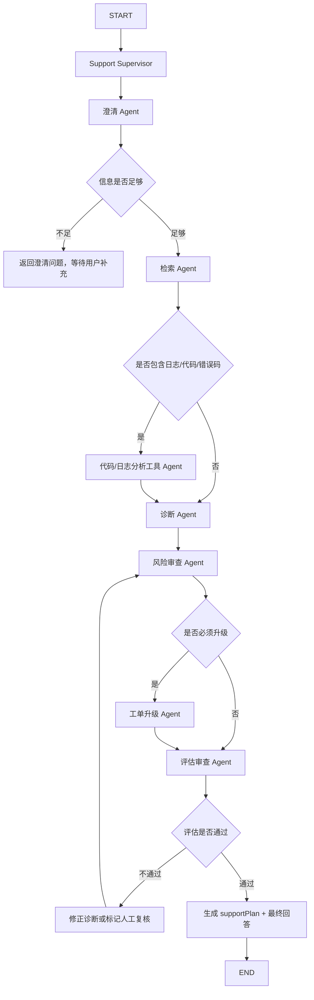

# 2026-06-18 企业售后技术支持 Supervisor 多 Agent 工作流计划

## 背景

当前项目已经完成企业售后技术支持知识库 Agent 第一版：FastAPI AI 服务在 `support / after-sales / technical-support` 场景下进入售后模式，默认路由到 `advanced-rag`，返回结构化 `supportPlan`；Spring Boot 只做业务桥接和 DTO 透传；React 工作台展示售后诊断方案。

当前 Agent 编排集中在 `ai-service/app/agents/workflow.py` 的 `StudyAgentWorkflow` 中，属于显式串行 workflow：

```text
detect_support_mode
-> classify_question
-> select_rag_strategy
-> retrieve_and_generate
-> cite_sources
-> generate_support_plan
-> compose_support_response
-> generate_follow_up_questions
-> generate_study_plan
-> generate_review_cards
```

用户希望下一步扩展为更细粒度的专业 Agent：

```text
澄清 Agent
-> 检索 Agent
-> 诊断 Agent
-> 风险审查 Agent
-> 工单升级 Agent
-> 代码/日志分析工具 Agent
-> 评估审查 Agent
```

本计划先完成架构判断和实施拆解，不直接开始代码实现。

## 架构结论

推荐采用 **受控 Supervisor + 显式状态图 + 强制安全闸门**。

不推荐纯粹的自由 Supervisor，也不推荐继续把所有逻辑塞进一个串行函数。原因如下：

- 售后技术支持是半高风险场景，模型不能自由跳过风险审查、证据校验和升级判断。
- 当前项目主 AI 服务仍是 `FastAPI 0.95.2 + Pydantic 1.10.26`，`pyproject.toml` 还没有正式引入 LangGraph / LangChain runtime。直接升级依赖可能影响 RAGAS、FastAPI 和现有测试。
- 当前已有 trace、workflowSteps、RAGAS 评估闭环和 Spring Boot DTO 桥接，最稳的路径是先做内部状态图和节点拆分，再在依赖栈稳定后切换到真实 LangGraph `StateGraph` / supervisor runtime。
- LangChain 官方多 Agent 文档将 supervisor、router、custom workflow 区分开。这个项目既需要 supervisor 的专业 Agent 调度，也需要 custom workflow 的确定性边界，因此应采用混合架构。

参考资料：

- LangChain Multi-agent: https://docs.langchain.com/oss/python/langchain/multi-agent
- LangChain Subagents and supervisor: https://docs.langchain.com/oss/python/langchain/multi-agent/subagents
- LangChain Router: https://docs.langchain.com/oss/python/langchain/multi-agent/router
- LangGraph Agents: https://langchain-ai.github.io/langgraph/agents/agents/

## 目标

1. 将售后 Agent 从单体 workflow 拆成可测试、可追踪、可评估的专业节点。
2. 引入 `SupportSupervisorWorkflow`，由 supervisor 根据状态决定下一步，但保留强制执行的安全闸门。
3. 保持前端只调用 Spring Boot `/api/*`，Spring Boot 只桥接，不实现 RAG / Agent 诊断逻辑。
4. 保持 `/ai/agent/invoke`、`/api/chat/{sessionId}/assistant-turn` 和现有 `supportPlan` 向后兼容。
5. 让 `workflowSteps` 能展示每个子 Agent 的执行结果，为前端流程图和后续评测做准备。
6. 将 RAGAS / 自定义评测集扩展到售后多 Agent 工作流，覆盖澄清、检索、诊断、风险、升级、引用可信度。

## 非目标

- 本阶段不接入真实外部工单系统。`工单升级 Agent` 先生成 `ticketDraft` / `ticketFields`，不调用 Jira、飞书、企业微信等外部 API。
- 本阶段不改变 Spring Boot 的职责边界，不在 Java 层实现任何售后诊断算法。
- 本阶段不把日志分析做成真实生产日志查询。先支持用户输入中的日志片段、报错栈、错误码和可选 mock 工具接口。

## 推荐工作流



关键点：

- `澄清 Agent` 可以提前终止本轮，要求用户补充信息。
- `风险审查 Agent` 和 `评估审查 Agent` 是强制闸门，不能被 supervisor 跳过。
- `代码/日志分析工具 Agent` 是条件节点，只在输入中存在日志、代码、错误码、trace id 或堆栈时触发。
- `工单升级 Agent` 也是条件节点，但高严重度、证据不足、风险过高时必须触发。

## Supervisor 职责

Supervisor 不直接生成最终答案，只负责状态调度和策略选择：

- 读取 `SupportAgentState`。
- 判断下一步应调用哪个节点。
- 控制循环次数，防止反复审查和修正。
- 汇总每个节点的结果到 `workflowSteps`。
- 在终态调用 response composer 生成最终 `output`、`supportPlan`、`citations`、`trace`。

Supervisor 的决策应以代码规则为主，LLM 判断为辅。初版建议采用确定性规则：

```text
if clarification.missing_required_fields:
    return CLARIFY
if incident.has_log_or_code_signal:
    run CODE_LOG_TOOL_AGENT
always run RETRIEVAL_AGENT before DIAGNOSIS_AGENT
always run RISK_REVIEW_AGENT after DIAGNOSIS_AGENT
if risk.requires_escalation:
    run ESCALATION_AGENT
always run EVALUATION_REVIEW_AGENT before final response
```

后续可以加入 LLM supervisor，但只能在这些约束内选择补充动作。

## 状态模型

新增 `ai-service/app/agents/states/support_state.py`，建议用 Pydantic v1 `BaseModel` 定义，避免 dataclass 和 API schema 来回转换。

核心状态：

```python
class SupportAgentState(BaseModel):
    request: AgentInvokeRequest
    workflow_version: str = "support-supervisor-v1"
    support_mode: bool = True
    route: SupportRouteState = SupportRouteState()
    incident: IncidentContext = IncidentContext()
    clarification: ClarificationResult | None = None
    retrieval: RetrievalEvidencePack | None = None
    log_analysis: CodeLogAnalysisResult | None = None
    diagnosis: DiagnosisResult | None = None
    risk_review: RiskReviewResult | None = None
    escalation: EscalationResult | None = None
    evaluation_review: EvaluationReviewResult | None = None
    support_plan: SupportPlan | None = None
    answer: str = ""
    citations: list[SourceMetadata] = []
    rag_trace: TraceMetadata | None = None
    workflow_steps: list[AgentWorkflowStep] = []
    loops: int = 0
```

`IncidentContext` 字段建议：

```text
product_name
module_name
version
environment
tenant_or_region
symptom
error_codes
log_snippets
trace_ids
impact_scope
severity_hint
started_at
recent_changes
attempted_actions
customer_expectation
missing_fields
```

这些字段不一定都由用户直接提供，澄清 Agent 可以从自然语言中抽取，也可以标记缺失。

## 子 Agent 合约

### 澄清 Agent

输入：

- `request.user_input`
- `request.variables`
- 历史上下文，后续可从 session messages 提取

输出：

```text
IncidentContext
missing_required_fields
clarification_questions
can_continue
confidence
```

必填字段建议：

- 故障现象
- 产品/模块或至少业务场景
- 影响范围
- 时间点或触发条件
- 错误码、日志、trace id 三者至少一个，若无则明确要求补充

提前终止规则：

```text
can_continue=false 时，本轮不调用检索和诊断，直接返回澄清问题。
```

### 检索 Agent

输入：

- `IncidentContext`
- 用户原始问题
- `knowledgeBaseId`
- metadata filters
- retrieval options

输出：

```text
RetrievalEvidencePack:
  strategy_name
  rewritten_query
  citations
  evidence_groups
  evidence_coverage
  missing_evidence_reasons
  rag_trace
```

实现方式：

- 复用现有 `RagService.query` 或增加轻量 `RagService.retrieve` 路径。
- 售后模式默认 `advanced-rag`。
- 根据问题类型启用 parent-child context。
- 保留 `rag_trace_id`、`rag_run_id`、citation score、chunk id、document id。

### 代码/日志分析工具 Agent

输入：

- `IncidentContext.log_snippets`
- `error_codes`
- `trace_ids`
- 用户粘贴的代码片段或堆栈

输出：

```text
CodeLogAnalysisResult:
  detected_error_type
  suspected_component
  key_signals
  timeline_hints
  safe_checks
  unsafe_actions
  confidence
```

初版实现：

- 不接外部日志系统。
- 先做规则和 LLM adapter 混合分析。
- 识别 HTTP 4xx/5xx、连接超时、鉴权失败、数据库连接、队列堆积、空指针、配置缺失等常见模式。

### 诊断 Agent

输入：

- `IncidentContext`
- `RetrievalEvidencePack`
- `CodeLogAnalysisResult`

输出：

```text
DiagnosisResult:
  hypotheses
  diagnostic_steps
  expected_signals
  fallback_actions
  evidence_mapping
  confidence
```

诊断原则：

- 每个假设必须关联证据或标记为待验证。
- 每个排查步骤必须有预期信号。
- 涉及生产变更、数据修复、重启、扩容、配置修改时必须交给风险审查 Agent 标记。

### 风险审查 Agent

输入：

- `DiagnosisResult`
- `IncidentContext`
- `RetrievalEvidencePack`

输出：

```text
RiskReviewResult:
  risk_level
  unsafe_actions
  required_human_confirmations
  data_safety_notes
  production_change_notes
  requires_escalation
  escalation_reason
  allowed_next_actions
```

强制规则：

- 无证据引用时，不能给确定性结论。
- 涉及客户数据、密钥、生产变更、删除、回滚、重启、权限修改时必须提示人工确认。
- P0/P1、全站不可用、核心客户受影响、证据不足且影响高，必须升级。

### 工单升级 Agent

输入：

- `IncidentContext`
- `DiagnosisResult`
- `RiskReviewResult`
- `RetrievalEvidencePack`

输出：

```text
EscalationResult:
  required
  severity
  suggested_queue
  ticket_summary
  ticket_description
  ticket_fields
  attachments
```

初版只生成工单草稿，不调用外部系统。

建议 `ticket_fields` 包含：

```text
knowledge_base_id
session_id
message_id
trace_id
rag_trace_id
severity
impact_scope
error_codes
trace_ids
evidence_chunk_ids
diagnostic_steps_done
remaining_questions
```

### 评估审查 Agent

输入：

- `IncidentContext`
- `RetrievalEvidencePack`
- `DiagnosisResult`
- `RiskReviewResult`
- `EscalationResult`
- 最终草稿答案

输出：

```text
EvaluationReviewResult:
  passed
  groundedness_score
  citation_coverage_score
  risk_compliance_score
  answer_completeness_score
  hallucination_flags
  missing_required_sections
  suggested_fixes
  candidate_eval_case
```

初版评估规则：

- 至少一个证据引用，除非明确标记证据不足并升级。
- 有澄清问题时，回答不能伪装成最终结论。
- 诊断步骤必须包含预期信号。
- 风险提示必须覆盖风险审查 Agent 发现的 unsafe actions。
- 工单升级建议必须与 severity 和风险判断一致。

后续接入：

- 将失败样本沉淀到 `rag_evaluation_cases` 草稿。
- 用 RAGAS 报告和自定义售后指标做离线评估。

## 输出模型设计

保留现有 `SupportPlan`，新增可选字段，保持向后兼容。

建议扩展：

```text
SupportPlan:
  issueSummary
  clarificationQuestions
  evidenceReferences
  diagnosticSteps
  escalation
  riskNotes
  nextActions
  incidentContext?          新增
  diagnosisSummary?         新增
  riskReview?               新增
  evaluationReview?         新增
  ticketDraft?              新增
```

如果担心 Spring Boot DTO 改动过大，也可以先把新增结构放入 `workflowSteps[].payload`，第二阶段再提升为正式字段。

## 目录规划

```text
ai-service/app/agents/
├── workflow.py                         # 保留旧 StudyAgentWorkflow，兼容非售后模式
├── graphs/
│   ├── __init__.py
│   └── support_supervisor.py           # 新 supervisor 状态图
├── nodes/
│   ├── __init__.py
│   ├── clarification_agent.py
│   ├── retrieval_agent.py
│   ├── code_log_tool_agent.py
│   ├── diagnosis_agent.py
│   ├── risk_review_agent.py
│   ├── escalation_agent.py
│   └── evaluation_review_agent.py
├── states/
│   ├── __init__.py
│   └── support_state.py
└── tools/
    ├── __init__.py
    └── log_pattern_tools.py
```

测试目录：

```text
ai-service/tests/
├── test_support_supervisor_workflow.py
├── test_support_clarification_agent.py
├── test_support_code_log_tool_agent.py
├── test_support_risk_review_agent.py
└── test_support_evaluation_review_agent.py
```

## 接口兼容策略

FastAPI：

- 保持 `POST /ai/agent/invoke` 不变。
- 当 `agent_name` 或 `variables` 命中售后模式时，路由到 `SupportSupervisorWorkflow`。
- 非售后模式继续走旧 `StudyAgentWorkflow`。

Spring Boot：

- `AgentService` 继续只做 DTO 映射。
- `AssistantTurnService` 继续保存 user/assistant message。
- 如果新增 `supportPlan` 字段，Java DTO 只做透传，不实现判断逻辑。

React：

- 第一阶段无需改页面也能显示旧字段。
- 第二阶段增强 `workflowSteps` 展示：澄清、检索、日志分析、诊断、风险、升级、评估。
- 第三阶段将 `incidentContext`、`riskReview`、`ticketDraft` 做成侧边栏卡片。

## 实施切片

### Phase 1: 状态和节点骨架

目标：

- 新增 `SupportAgentState` 和所有 node 输入输出 schema。
- 每个 node 先实现确定性规则版本。
- 所有 node 都写入 `AgentWorkflowStep`。

验收：

- 单元测试覆盖每个 node 的基本输入输出。
- 不调用 LLM 也能跑通一条售后流程。

### Phase 2: SupportSupervisorWorkflow

目标：

- 新增 `SupportSupervisorWorkflow`。
- 将售后模式从 `StudyAgentWorkflow` 切到 supervisor。
- 实现强制闸门：澄清不足提前返回，诊断后必须风险审查，最终前必须评估审查。

验收：

- `technical-support-agent` 走新 workflow。
- 普通 `study-agent` 不受影响。
- `workflowSteps` 包含 7 类节点中的实际执行节点。

### Phase 3: RAG 和日志工具增强

目标：

- `RetrievalAgent` 深度复用 `RagService`。
- `CodeLogToolAgent` 支持日志/堆栈/错误码模式识别。
- 检索证据不足时，让 supervisor 进入升级或澄清路径。

验收：

- 有日志输入时触发日志分析节点。
- 无证据引用时不会生成确定性诊断结论。

### Phase 4: DTO 和前端可视化

目标：

- Spring Boot DTO 透传新增 `supportPlan` 可选字段。
- React Chat 页面展示更完整的 workflowSteps 和风险/工单草稿。

验收：

- 前端仍只访问 `/api/*`。
- `/chat` 页面能看到节点链路和每个节点状态。

### Phase 5: 评估闭环

目标：

- 新增售后 Agent 专项测评集。
- 将 `EvaluationReviewResult` 与 RAGAS/自定义指标对齐。
- 支持将评估失败样本导出为 DRAFT 测评集。

建议指标：

```text
clarification_needed_accuracy
evidence_groundedness
diagnostic_step_completeness
risk_gate_recall
escalation_decision_accuracy
ticket_field_completeness
citation_coverage
unsafe_action_block_rate
```

验收：

- 至少 12 条售后专项样本。
- 覆盖信息不足、证据不足、P0/P1、日志分析、无需升级、必须升级等场景。

### Phase 6: 可选 LangGraph runtime 迁移

触发条件：

- 主服务依赖栈确认可以引入 LangGraph。
- Pydantic v1/v2 冲突风险解决。
- 现有 supervisor 状态和 node 合约稳定。

迁移路径：

- 将 `SupportSupervisorWorkflow` 的条件边迁移到 LangGraph `StateGraph`。
- 每个 node 保持同名函数和同样输入输出。
- 保留当前 Python supervisor 作为 fallback 或测试对照。

## 安全策略

1. 证据不足安全策略
   - 可以生成澄清问题。
   - 可以生成待验证假设。
   - 不能生成确定性根因。
   - 高影响时必须升级。

2. 生产变更安全策略
   - 重启、删除、回滚、权限修改、数据修复、配置下发都必须进入风险审查。
   - 未明确回滚方案时，不能建议直接执行。

3. 数据安全策略
   - 不在答案中复述密钥、token、完整个人信息。
   - 工单草稿中只保留必要脱敏字段。

4. 循环控制
   - 评估审查失败最多回到风险审查/诊断修正 1 次。
   - 超过次数则标记人工复核。

## 测试计划

AI 服务单测：

```powershell
cd ai-service
.\.venv\bin\python.exe -m pytest tests\test_support_supervisor_workflow.py -q
.\.venv\bin\python.exe -m pytest tests\test_support_clarification_agent.py tests\test_support_risk_review_agent.py -q
```

Java 测试：

```powershell
mvn.cmd -f backend-java\pom.xml test "-Dtest=AgentServiceTest,AssistantTurnServiceTest"
```

React 验证：

```powershell
npm.cmd --prefix frontend-react run typecheck
npm.cmd --prefix frontend-react run build
```

端到端场景：

1. 信息不足：用户只说“客户打不开系统”，应返回澄清问题，不直接诊断。
2. 有错误码：用户提供 504 和 trace id，应检索并生成排查步骤。
3. 有日志片段：应触发代码/日志分析工具 Agent。
4. 高影响：全站不可用或 P0，应强制生成升级草稿。
5. 证据不足：无 citation，应标记证据不足和人工复核。
6. 普通问答：非售后 agent 不受影响。

## 前端展示计划

`workflowSteps` 建议展示为 7 个节点状态：

```text
澄清
检索
日志分析
诊断
风险审查
工单升级
评估审查
```

每个节点展示：

- 状态：已执行 / 跳过 / 等待补充 / 失败
- 核心结论
- 关键 payload 摘要
- trace id / rag trace id

前端页面原则：

- 保持中文。
- 不让“Agent 架构解释文字”占据主要屏幕。
- 以工单处理人员需要的任务信息为主：缺什么、查到了什么、判断什么、风险是什么、下一步做什么。

## 数据库影响

Phase 1 到 Phase 3 不需要新表。

可选 Phase 4/5 新增：

- `agent_workflow_runs`
- `agent_workflow_steps`

但当前已经有 `trace` 和 `workflowSteps` 响应，建议先不加数据库迁移，等前端和评测稳定后再决定是否落库。

## 风险和应对

- 依赖风险：暂不引入 LangGraph 主依赖，先做本地状态图。
- 复杂度风险：每个 node 独立测试，Supervisor 只做调度，不混入诊断细节。
- 幻觉风险：评估审查和风险审查强制执行，证据不足时降级为澄清或升级。
- DTO 膨胀风险：新增字段先可选，必要时放入 `workflowSteps.payload`。
- 前端过载风险：先展示节点状态和摘要，不一次性展示所有 payload。

## 验收标准

- 售后模式请求走 `SupportSupervisorWorkflow`。
- 信息不足时返回澄清问题，不执行最终诊断。
- 含日志/代码/错误码时触发代码/日志分析节点。
- 所有最终回答前必须经过风险审查和评估审查。
- 高严重度或证据不足时生成工单升级草稿。
- `supportPlan` 保持兼容，React 旧展示不崩。
- `workflowSteps` 可清楚还原每个子 Agent 的执行路径。
- AI 服务、Java 桥接、React 构建测试通过。

## 2026-06-18 实施更新

本轮已继续推进 Agent 部分开发，并在多 agent 协作中完成一次架构勘察和一次代码审查。实际落地结果：

1. 上一轮先把 `SupportSupervisorWorkflow` 做成可选 LangGraph runtime 预留点；本轮已升级为默认 `auto` 的真实 LangGraph / local 双 runtime。
2. 上一轮暂未把 LangGraph 写入主依赖；本轮已在隔离 managed Python 环境验证兼容性并将 `langgraph==0.1.5` / `langchain-core==0.2.8` 写入 `pyproject.toml` 和 `uv.lock`。
3. `SupportAgentState` 固化 `workflow_runtime`、`workflow_status`、`required_gates`、`completed_gates`、`skipped_gates`，并同步到 trace 顶层属性。
4. 澄清早退路径明确为 `needs_clarification`，并记录 skipped gates；非澄清终态必须完成检索、诊断、风险审查、工单升级和评估审查。
5. 评估失败路径明确为 `needs_review`，最终回答追加“人工复核要求”，`supportPlan.riskNotes` 追加人工复核风险提示，Agent trace status 不再一律写 `completed`。
6. 旧 `StudyAgentWorkflow` 直接收到 support 请求时会拒绝执行，并移除不可达的旧售后分诊生成逻辑，避免绕过售后 supervisor 的澄清、风险和评估 gate。
7. `EvaluationReviewAgent` 移除 mojibake 中文兜底，只有真实 UTF-8 中文或英文关键词能满足章节检查。

新增/更新测试：

- `ai-service/tests/test_agent_workflow.py`：覆盖 support gate trace、澄清早退、评估失败 `needs_review`、旧 workflow support 绕行拒绝。
- `ai-service/tests/test_support_supervisor_graph.py`：覆盖 runtime 选择、required/completed/skipped gates 契约，以及 LangGraph optional lazy-load。
- `ai-service/tests/test_support_agent_nodes.py`：继续覆盖风险审查、真实中文识别、评估样本草稿生成。

已执行验证：

```powershell
ai-service\.venv\bin\python.exe -m compileall -q ai-service\app\agents ai-service\app\services\agent_service.py
ai-service\.venv\bin\python.exe -m pytest ai-service\tests\test_agent_workflow.py ai-service\tests\test_support_agent_nodes.py ai-service\tests\test_support_supervisor_graph.py ai-service\tests\test_strategy_comparison_evaluator.py -q --basetemp .tmp\pytest-support-agent-full -o cache_dir=.tmp\pytest-cache-support-agent-full
mvn.cmd -f backend-java\pom.xml test "-Dtest=AgentServiceTest,AssistantTurnServiceTest"
```

后续建议：

1. 在独立分支评估 FastAPI / Pydantic v2 升级，再迁移到当前 LangGraph / LangChain 版本线。
2. 将 `workflowSteps` 的 gate 状态映射到 React 售后工作台流程条。
3. 把 `EvaluationReviewResult.candidate_eval_case` 自动进入售后专项评测集草稿池，形成 Agent 工作流评测闭环。

## 2026-06-18 LangGraph / LangChain Core 接入更新

本轮在保持 `FastAPI 0.95.2 + Pydantic 1.10.26` 主服务基座不升级的前提下，正式引入兼容版本：

```text
langgraph==0.1.5
langchain-core==0.2.8
```

运行时策略：

- `AI_AGENT_SUPPORT_WORKFLOW_RUNTIME=auto`：默认模式。依赖可用时走 LangGraph `StateGraph.compile().ainvoke(...)`，依赖不可用时可观测回落到本地 runtime。
- `AI_AGENT_SUPPORT_WORKFLOW_RUNTIME=langgraph`：强制 LangGraph。依赖缺失、图构建失败或执行失败会直接抛错，不伪装为成功。
- `AI_AGENT_SUPPORT_WORKFLOW_RUNTIME=local`：强制本地 runtime，用于排障和对照测试。
- 旧 `AI_AGENT_ENABLE_LANGGRAPH_RUNTIME=true/false` 仍兼容，其中 `true` 映射为强制 `langgraph`，`false` 映射为 `local`；建议新配置使用 `AI_AGENT_SUPPORT_WORKFLOW_RUNTIME`。
- `auto` 仅在依赖缺失或图构建前失败时回落；一旦 LangGraph 图开始执行，执行期异常会直接抛出并写入 `support_workflow_runtime_error`，避免复用已被部分节点修改的 state 重跑 local runtime。

实现结果：

- `SupportSupervisorWorkflow` 的正常图路径由真实 LangGraph `StateGraph` 驱动，节点包括澄清、检索、代码/日志分析、诊断、风险审查、工单升级、最终草稿准备、评估审查和 finish。
- LangGraph 节点通过 LangChain Core `RunnableLambda` 包装，并保留 `run_name` / `tags`，后续可接 LangSmith 或自定义可观测系统。
- 代码/日志分析能力抽成 `analyze_support_log_patterns`，并提供 LangChain `StructuredTool` 构造函数 `build_support_log_pattern_tool()`；当前 workflow 仍保持确定性调用，不让 LLM 自由跳过风险闸门。
- 本地 runtime 与 LangGraph runtime 共享同一批 `_node_*` 方法，避免两套逻辑漂移。
- `uv.lock` 已通过 `UV_PROJECT_ENVIRONMENT=..\.tmp\uv-test-ai-service-langgraph` 和 managed Python 3.12 刷新，绕开当前项目 `.venv` 的 Mingw 平台识别问题。

验证通过：

```powershell
$env:UV_PROJECT_ENVIRONMENT='..\.tmp\uv-test-ai-service-langgraph'; uv run --python 3.12 --managed-python --extra dev python -m pytest tests\test_agent_workflow.py tests\test_support_agent_nodes.py tests\test_support_supervisor_graph.py tests\test_strategy_comparison_evaluator.py -q --basetemp ..\.tmp\pytest-support-agent-langgraph -o cache_dir=..\.tmp\pytest-cache-support-agent-langgraph
mvn.cmd -f backend-java\pom.xml test "-Dtest=AgentServiceTest,AssistantTurnServiceTest"
```

本地注意事项：

- 当前 `ai-service\.venv\bin\python.exe` 是 Mingw/MSYS 风格 Python，直接 `uv lock` 会报 `Unknown operating system: mingw_x86_64_msvcrt_gnu`；使用临时 `UV_PROJECT_ENVIRONMENT` 可规避。
- 该 `.venv` 用 pip 安装 `langchain-core` 依赖链时会在 `orjson` 构建处失败；标准 Windows CPython / uv managed Python 3.12 环境可正常解析并测试通过。
